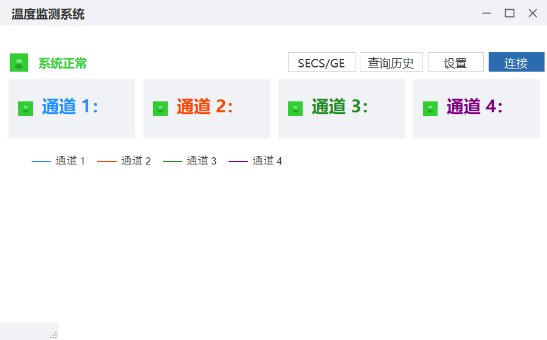

# TemperatureMonitor 温度监控上位机系统

> 面向**半导体设备、储能 / 光伏设备、锂电设备、高端工业检测 / 医疗设备、优质非标自动化**等行业设备厂的上位机软件。
> 基于 C# / WinForms / .NET Framework 4.8，实现「数据采集 → 实时显示 → 持久化存储 → 历史查询 → 报警联动」完整业务闭环。

## 界面预览



> 更多界面截图（实时曲线 / 报警闪烁 / SECS-GEM 测试 / 历史查询）持续补充中。

## 核心特性

- **双协议通讯**：Modbus TCP（NModbus4）温度采集 + SECS/GEM（Secs4Net，HSMS）半导体设备通信
- **实时监控**：4 通道温度实时曲线（滚动 5 分钟窗口）、独立圆形报警指示灯（超上限 / 低下限）、报警闪烁 + 提示音
- **异步采集不卡 UI**：async/await + 后台线程执行阻塞 IO，防重入保护，断线自动重连
- **数据持久化**：SQLite + Dapper 仓储模式，每 5 秒批量事务写入，支持时间段查询与 CSV 导出（Excel 直接打开不乱码）
- **工程化完善**：JSON 配置热更新、NLog 日志归档、全局异常捕获、高 DPI 适配（PerMonitorV2）、MSI 安装包部署

## 技术栈

| 分类 | 技术 |
|------|------|
| 语言 / 框架 | C# / WinForms / .NET Framework 4.8 |
| 通讯协议 | Modbus TCP（NModbus4 2.1）、SECS/GEM HSMS（Secs4Net 2.4） |
| 数据存储 | SQLite（System.Data.SQLite）+ Dapper 2.1 |
| 配置 / 日志 | Newtonsoft.Json 13 / NLog 5.3 |
| 图表 / 打包 | Chart 控件实时曲线 / Visual Studio Installer Projects（MSI） |

## 架构设计

```
UI 层（WinForms：MainForm / FrmConfig / FrmQuery / FrmSecsTest）
        │
业务层（ModbusClient 采集 + 重连 · SecsGem 通讯 · ConfigManager 配置）
        │
数据层（TemperatureLogRepository / AlarmLogRepository / DatabaseInitializer）
        │
SQLite（TemperatureLog / AlarmLog）
```

- **UI 与业务解耦**：窗体只负责展示与交互，采集逻辑封装在 ModbusClient，数据访问封装在仓储层
- **异步不阻塞 UI**：`await Task.Run(ReadRegisters)` 后台读，回到 UI 线程更新控件
- **配置驱动**：IP / 端口 / 采样间隔 / 报警阈值集中在 config.json，运行时热更新

## 快速开始

**方式一：直接运行**（无需设备）

运行 `bin\Debug\TemperatureMonitor.exe` 即可看到完整界面；点「连接」尝试连 127.0.0.1:502，无设备时状态栏显示「通信中断」（可观察断线处理）。

**方式二：模拟器完整演示**（Modbus Slave + SECS/GEM 模拟器）

1. Modbus Slave 建从站（Slave ID=1，功能码 03，起始地址 0，8 个寄存器，输入 4 组温度值）
2. 程序点「连接」→ 4 通道温度与曲线实时更新
3. 把某通道改成 120（超上限 80）→ 观察报警灯变红闪烁 + 提示音
4. 关闭模拟器 → 状态栏「通信中断」；重启模拟器 → 自动重连恢复
5. 「SECS/GEM 测试」→ 连接模拟器 → 发送 S1F1 接收 S1F2 回复报文

## 打包部署

VS 中切换 Release | x86，生成 MSI 安装包（已内置 SQLite.Interop.dll x86/x64 与配置文件），安装后自动建库、写日志，桌面快捷方式开箱即用。

## 项目结构

```
TemperatureMonitor/
├── MainForm.cs / .Designer.cs    # 主窗体（实时监控 / 曲线 / 报警）
├── FrmConfig.cs                  # 系统设置（IP / 端口 / 阈值）
├── FrmQuery.cs                   # 历史查询 + CSV 导出
├── FrmSecsTest.cs                # SECS/GEM 通讯测试
├── ModbusClient.cs               # Modbus TCP 采集 + 自动重连
├── ConfigManager.cs              # config.json 配置管理
├── DatabaseInitializer.cs        # 首次运行自动建表
├── TemperatureLogRepository.cs   # 温度仓储（Dapper）
├── AlarmLogRepository.cs         # 报警仓储（Dapper）
└── Models/                       # 数据模型
```

## 可扩展方向

配方管理（温度曲线编辑 / 下发 / 执行）、操作员 / 工程师 / 管理员权限、班次报表导出、更多设备协议（RS232/485、S7、MC）、Web 看板 / 远程监控。
